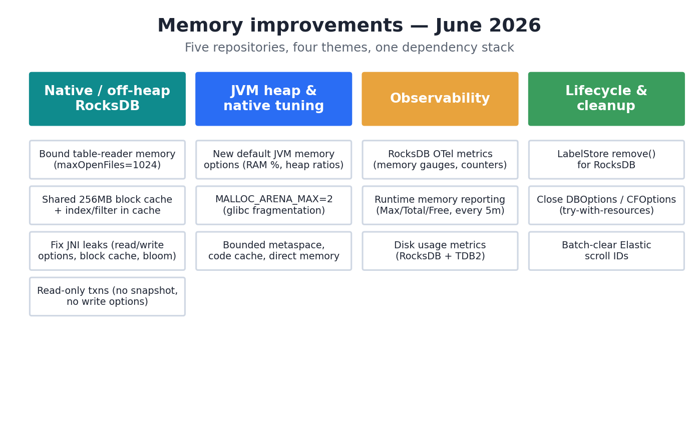
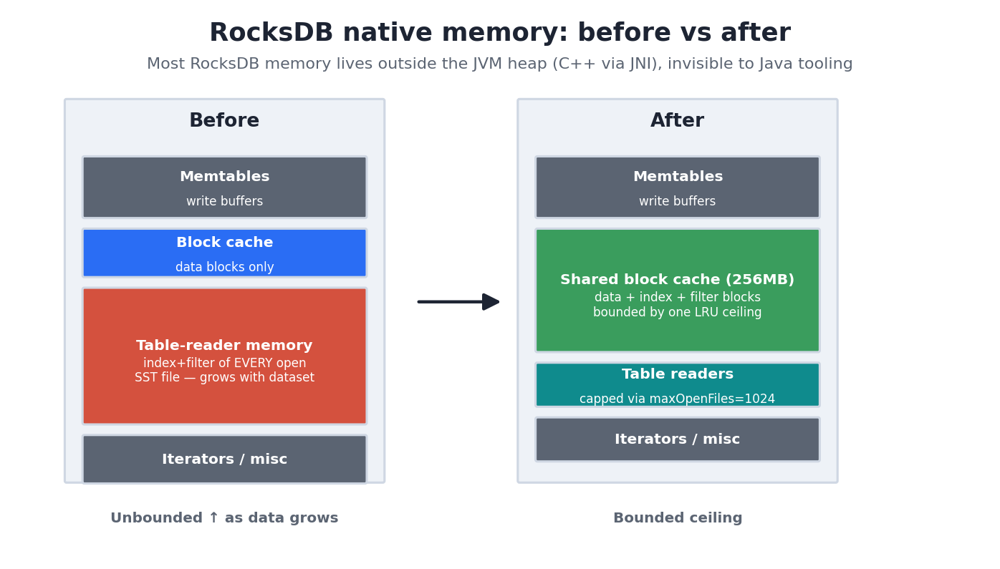
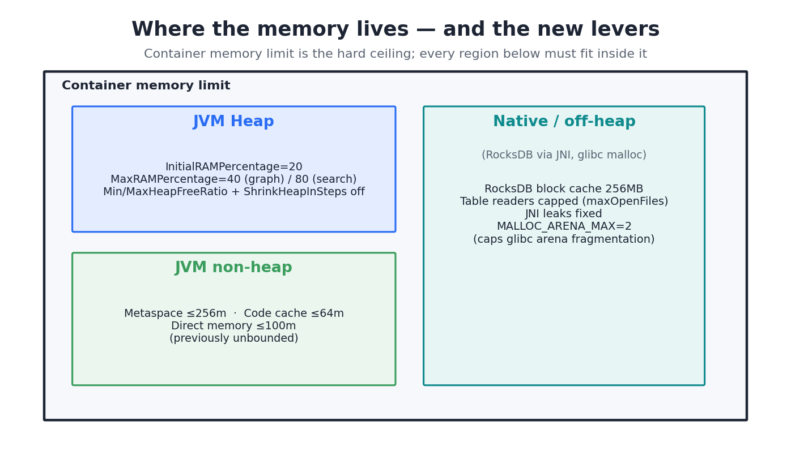
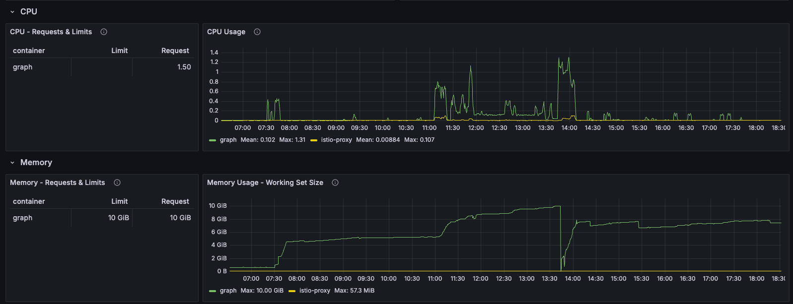
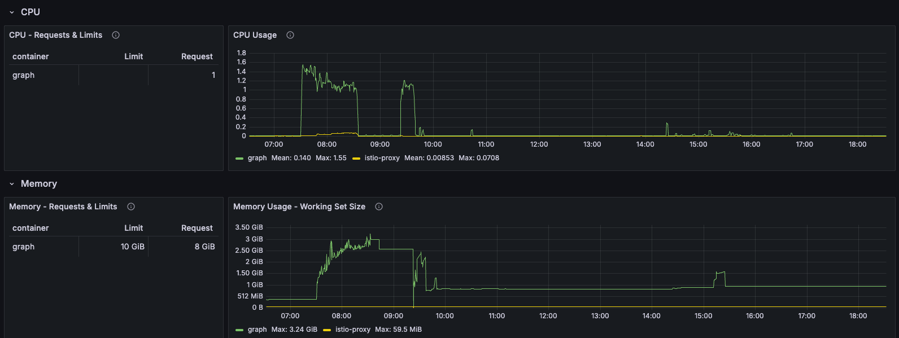
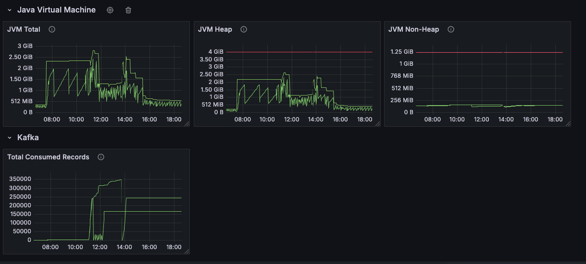
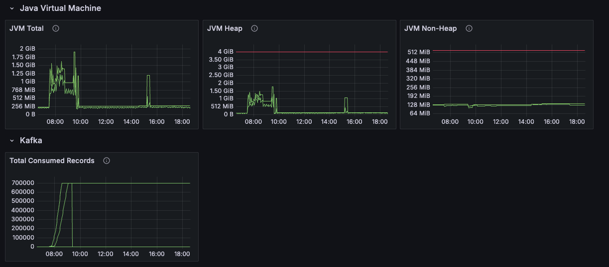

# Memory Improvements — June 2026

A review of the memory-related work in June 2026, focused on **Smart Cache Search** and **Smart Cache Graph** — and the shared libraries underneath.

---

## TL;DR

The driver was repeated Out-Of-Memory (OOM) crashes of both SC Search and SC Graph in both the SI & QA test environments. 
A coordinated investigation reduced and bounded memory usage across the stack and made it observable.

Each app needed different fixes:

- **Smart Cache Search** — the wins were mostly about *releasing server-side and in-flight resources*: clearing Elasticsearch context-scroll sessions properly (CORE-1318, building on CORE-1101), cancelling in-flight requests that had already failed or timed out (CORE-1338), and capping native allocator fragmentation with `MALLOC_ARENA_MAX=2`.
- **Smart Cache Graph** — the picture was more myriad. The headline fix was **correcting leaking RocksDB read/write options**, alongside a set of related transaction-processing and snapshot fixes in RocksDB, sensible default JVM memory options, and the same `MALLOC_ARENA_MAX=2` lever.

Underneath both apps, the shared libraries (`smart-cache-storage`, `rdf-abac`, `smart-caches-core`) gained the actual RocksDB memory caps, leak fixes and observability that the apps inherit.



Most of this work is tracked under JIRA tickets **CORE-1318**, **CORE-1338**, **CORE-1101**, **CORE-1350**, **CORE-1147** and **CORE-1310**.

---

## Why this work happened

The crashes were intermittent and grew worse as datasets grew, which pointed at memory that was accumulating rather than a single bad allocation. 
A large part of the difficulty was that the worst offenders were *native* (off-heap) memory, not the JVM heap. 
The graph and label stores are backed by RocksDB, a C++ library used from Java via JNI, so most of its memory lives **outside** the JVM heap and never appears in heap dumps or standard JVM metrics. 
The first problem, therefore, was that we couldn't even *measure* where the memory was going. 
That is why the work pairs **bounding memory** (caps, leak fixes, cancelling/releasing work) with **observability** (metrics and periodic reporting): as you can't manage what you can't see.

---

## Smart Cache Search — what fixed it

Search's memory and stability problems were dominated by **resources that were never released** — both on the Elasticsearch side and within in-flight request handling.

**1. Context-scroll clearing (CORE-1318, building on CORE-1101).**
Search uses Elasticsearch *scroll* contexts to page through large result sets. 
Each open scroll holds server-side resources until it is explicitly cleared, and these were lingering.
Previous work to optimise request processing by off-loading the clearing of scrolls, CORE-1101, actually caused performance degradation under concurrency.
The fix (CORE-1318) collects the scroll IDs used by a query and clears them once scrolling completes, reverting to a synchronous clean-up by default** and tightened the concurrency handling (checking state before synchronising, rather than serialising every request). 
This was the single most impactful change for Search.

**2. `MALLOC_ARENA_MAX=2` (native allocator fragmentation).**
glibc's allocator creates many memory "arenas" (roughly CPU × 8 — e.g. 32 on a typical QA node), and these hold on to freed memory, inflating apparent RSS and pushing the container towards its limit. 
Running with `MALLOC_ARENA_MAX=2` caps that fragmentation/retention.

**3. Default JVM memory options (CORE-1120 / CORE-1147).**
The Search Helm charts now ship far more sensible JVM defaults (heap as a percentage of container memory, controlled heap give-back, and ceilings on previously-unbounded metaspace/code-cache regions) so that JVM doesn't over-commit inside the container.

**4. Cancelling failed / timed-out in-flight requests (CORE-1338).**
Requests that exceeded their timeout were leaving work running in the background. CORE-1338 cancels these in-flight requests when a query exceeds its timeout, so that failed requests stop consuming memory and resources instead of running to completion unnoticed.
Another related issue was that in order to calculate whether a request had timed out, we waited for the initial request to return. That meant a timed out request could take a full minute to return before we could calculate that the threshold of, say, 15 seconds had passed.

---

## Smart Cache Graph — what fixed it

For Graph the cause was more myriad, and centred on RocksDB (which backs the security label store via `rdf-abac`). The fixes live mostly in the shared `smart-cache-storage` / `rdf-abac` libraries that Graph consumes.

**1. Leaking RocksDB read/write options (the main fix).**
RocksDB `ReadOptions` / `WriteOptions` objects were being allocated per transaction and **never freed**, leaking native memory on *every* single read and write. Over a long-running graph service this steadily climbed until the container OOM'd. 
The fix introduces shared, reused options with proper cleanup (`ShortLivedTransactionContext`, `NestedTransactionContext`) so these native objects are released.

**2. Related transaction-processing and snapshot fixes.**
Several connected RocksDB issues were addressed alongside the read/write options leak:

- **Read-only operations no longer take a snapshot** and no longer allocate a full transaction. A new `ReadOnlyTransactionContext` *"performs direct RocksDB reads without allocating a transaction"* — no transaction object, no write options.
- Label-store transactions are now **read/write aware**, so read paths take the cheap route (CORE-1350, in `rdf-abac`).
- `LabelStore.remove()` was implemented for RocksDB so deletions actually release storage rather than leaving orphaned entries (CORE-1310).
- A proper **`LabelStore.remove()`** plus safe-guarded delete transactions, and closing `DBOptions` / `ColumnFamilyOptions` (and the block cache / bloom filter) via try-with-resources, including across a `restore()`.

**3. RocksDB memory is now bounded.**
The RocksDB defaults were changed so native memory has a ceiling rather than growing with the dataset. This is what stops the slow climb that led to OOM.



**4. JVM defaults, `MALLOC_ARENA_MAX`, and observability.**
Graph ships default JVM memory options (CORE-1147), defaults `MALLOC_ARENA_MAX=2` in its container image (CORE-1318), and gained a disk-usage metric for TDB2 datasets plus a new `FMod_MemoryInfo` module that periodically reports memory to the logs (CORE-1147).



---

## Measured impact — SI (improved) vs QA (older)

The charts below compare a Smart Cache Graph instance running the **improved build in SI** against an **older instance in QA**, over a comparable day. 
These are opportunistic snapshots rather than a controlled benchmark (see the caveats), but the difference is stark.

**Container memory (working set).** The clearest result. 
The older QA instance climbs steadily to the **10 GiB container limit**, hits it around 13:30, and drops sharply — the signature of an OOM/restart — before recovering to a sustained ~7 GiB. The improved SI instance peaks at **3.24 GiB during initial ingest** and then settles to a flat **~1 GiB** for the rest of the day.

<table>
<tr><th>QA — older build</th><th>SI — improved build</th></tr>
<tr>
<td></td>
<td></td>
</tr>
</table>

**JVM heap & total.** The older build sustains ~2–2.5 GiB of heap with heavy GC sawtooth throughout the day. 
The improved build drains its heap back to near-zero once ingest is done, with JVM total settling to ~256 MiB and non-heap roughly halving (~256 MiB → ~128 MiB) thanks to the metaspace/code-cache ceilings.

<table>
<tr><th>QA — older build</th><th>SI — improved build</th></tr>
<tr>
<td></td>
<td></td>
</tr>
</table>

**What stands out:** the improved instance did **more** work for **less** memory — it consumed ~700k Kafka records versus ~350k on the older instance, yet idled at ~1 GiB working set instead of climbing into the multi-GiB range and hitting the limit. Crucially, the steady upward climb that ends in an OOM on the older build is gone; the improved build returns memory after ingest and holds flat.

> **Caveats (this is illustrative, not a benchmark).** The two instances were not perfectly matched: ingest volumes differ (~700k vs ~350k records), the time windows and workloads aren't identical, and resource settings differ (QA: request 10 GiB / CPU 1.5; SI: request 8 GiB / CPU 1). Treat these as supporting evidence of the direction and magnitude of the improvement rather than precise figures.

---

## The shared foundation

The bulk of the RocksDB memory work lives in `smart-cache-storage` (with `rdf-abac` consuming it and `smart-caches-core` providing reporting).

**Bounding RocksDB native memory.** 
A RocksDB database is an LSM-tree; its native memory is roughly memtables + block cache + **table-reader memory** (the index/filter blocks of every *open* SST file) + iterators + misc. 
The table-reader term was the problem: `maxOpenFiles` defaulted to `-1`, so RocksDB kept every SST file open and pinned its index/filter blocks indefinitely, growing without limit as data grew. 
The new defaults:

- **`maxOpenFiles` capped at 1024** — bounds pinned table-reader memory.
- A **single shared 256 MB LRU block cache** across all column families — one bounded ceiling.
- **`cache_index_and_filter_blocks` enabled** so index/filter blocks live inside (and are bounded by) the shared cache rather than unbounded table-reader memory; marked high-priority so they're evicted last, with L0 blocks pinned.

A subtle bug fix went with this: these settings *must* be applied via `ColumnFamilyOptions` to take effect — they were previously set in a way that silently never applied. This fix was applied with an accompanying guide to the configuration - `docs/rocksdb-configuration-reference.md`.

**Native leak fixes.** Beyond the read/write options leak above, `openInternal()`/`closeInternal()` now track and free the configured block cache and bloom filter, and `DBOptions`/`ColumnFamilyOptions` are released via try-with-resources (including across `restore()`).

**Default JVM memory options (CORE-1147).** Instead of letting the JVM guess, the charts now set:

```
-XX:InitialRAMPercentage=20 -XX:MaxRAMPercentage=40   (graph; 80 for search)
-XX:MinHeapFreeRatio=20 -XX:MaxHeapFreeRatio=40 -XX:-ShrinkHeapInSteps
-XX:InitialCodeCacheSize=8m -XX:ReservedCodeCacheSize=64m
-XX:MetaspaceSize=32m -XX:MaxMetaspaceSize=256m
-XX:MaxDirectMemorySize=100m
```

These bound the heap relative to container memory, control how aggressively the heap gives memory back, and cap previously-unbounded regions (metaspace, code cache, direct memory).

**Observability (CORE-1147).** RocksDB now exposes OpenTelemetry metrics (memory gauges, transaction counters including active transactions, internal stats), and `smart-caches-core` reports **Max/Total/Free** memory separately and **periodically logs memory every 5 minutes** (configurable via `MEMORY_INFO_INTERVAL` / `--memory-info-interval`). Disk-usage metrics were added for RocksDB and TDB2.

> Note: a "Kafka memory" change was explored in `smart-caches-core` (stashed `KafkaEventSource` work) but was not merged in this window as the results were somewhat inconclusive in the limited testing afforded to a dev laptop.

---

## Net effect

Both applications moved from *"native memory can grow and leak without limit, and we can't see it"* to *"every major memory region has a configured ceiling, the leaks and lingering resources that eroded those ceilings are closed, and actual usage is reported via metrics and logs."*

For **Search**, releasing scroll contexts and cancelling failed in-flight work removed the steady resource build-up that triggered OOMs. For **Graph**, fixing the leaking read/write options and bounding RocksDB's native memory removed the slow climb that led to the same outcome. In both cases the new metrics and periodic memory reporting mean future regressions should be caught early rather than discovered as a crash in production.
