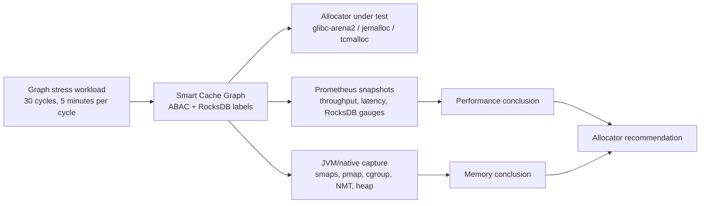
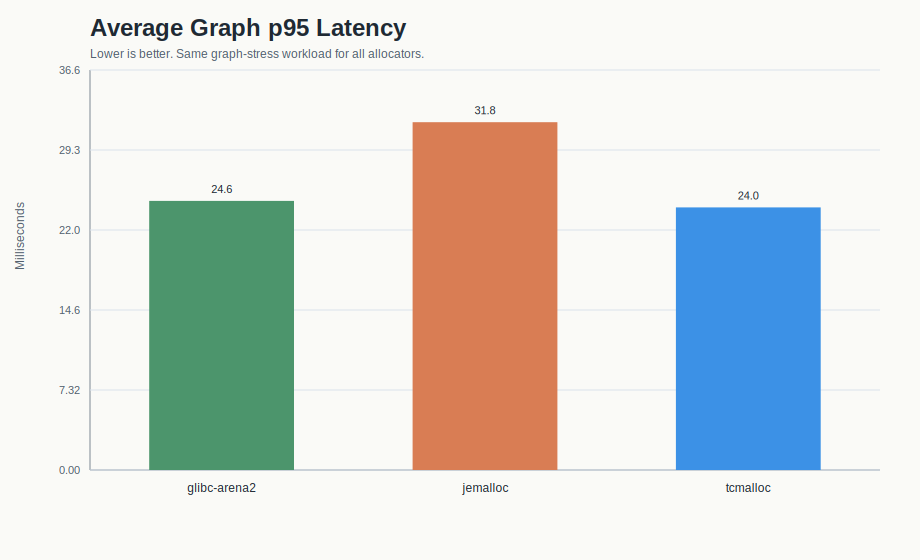
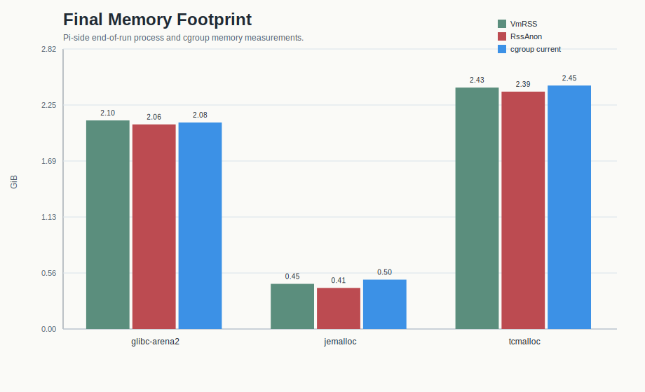
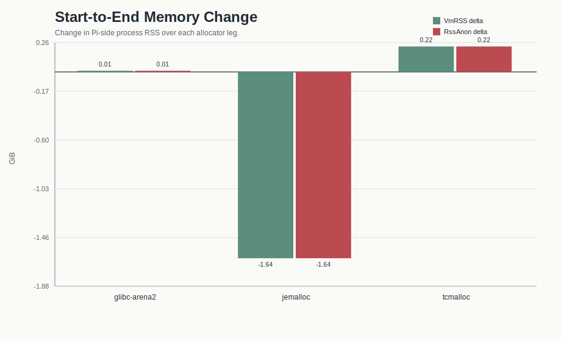
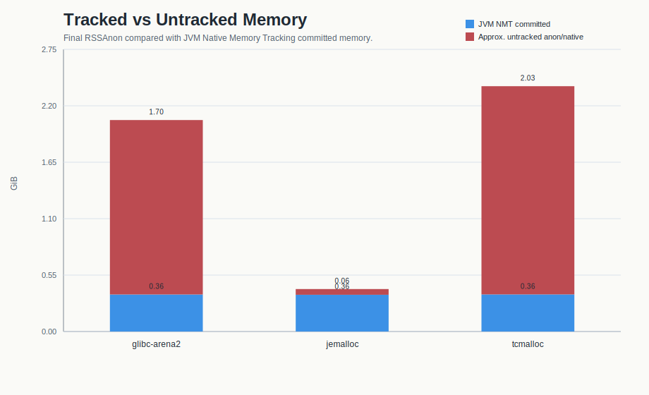
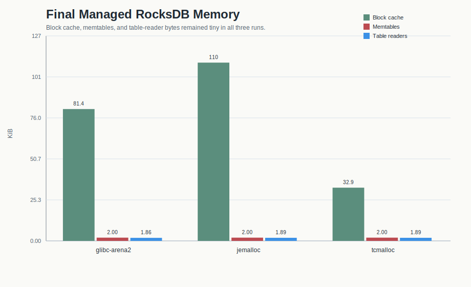
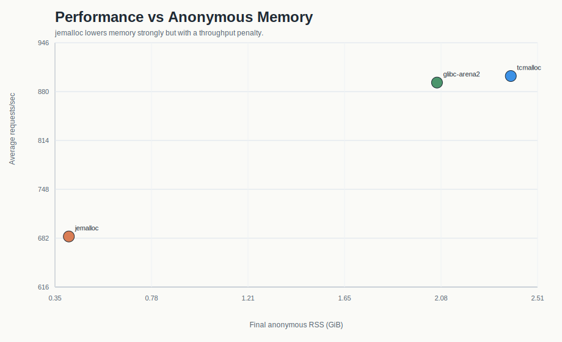
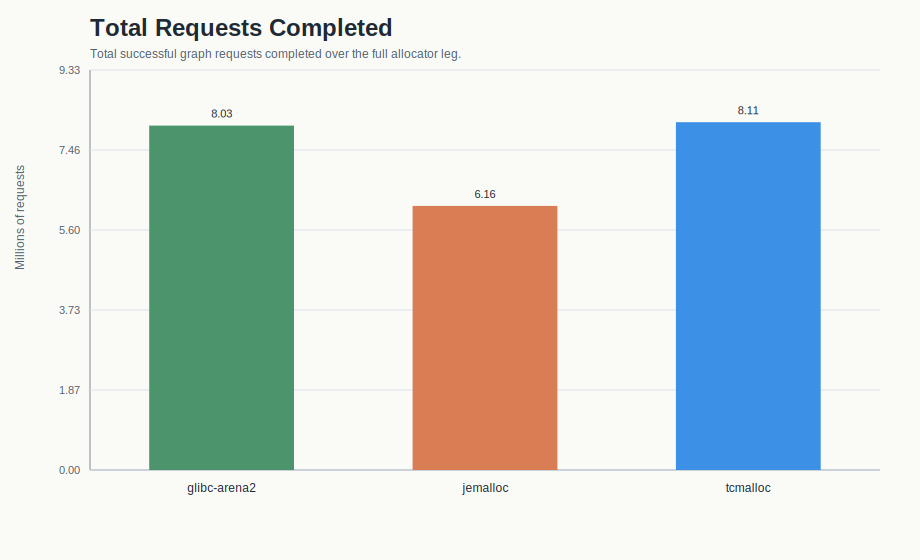
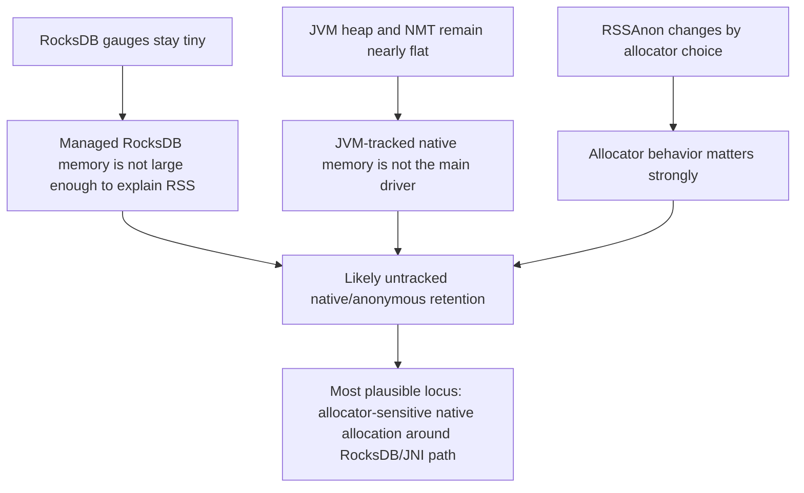

# Smart Cache Graph Allocator Comparison

## Purpose

This report compares three allocator configurations for ABAC/RocksDB Smart Cache Graph:

- `glibc-arena2`
- `jemalloc`
- `tcmalloc`

The goal was not just to check stability. The main question was whether the large anonymous/native memory signature seen in earlier ABAC runs could be changed by the allocator, and whether that change came with a throughput or latency cost.

## Executive Summary

Three conclusions matter most:

1. `jemalloc` is the only allocator that materially reduced resident anonymous/native memory.
2. `jemalloc` paid for that gain with a substantial throughput penalty.
3. `tcmalloc` slightly improved throughput, but made the memory footprint worse than `glibc-arena2`.

That combination is important because JVM-tracked memory remained nearly flat across all three runs.
This is expected - without diverging too much; as the memory issues experienced are not tied to JVM in any way but rather the underlying native memory.
Thus, the allocators changed the size of anonymous/native memory, not the Java heap. 

## Runs Covered

| Allocator | Run ID | Date | Result |
| --- | --- | --- | --- |
| `glibc-arena2` | `20260623T_allocator_compare_24h-glibc-arena2` | June 23-24, 2026 | Completed cleanly |
| `jemalloc` | `20260624T_allocator_compare_remaining-jemalloc` | June 24-25, 2026 | Completed cleanly |
| `tcmalloc` | `20260625T_allocator_compare_tcmalloc-tcmalloc` | June 25, 2026 | Completed cleanly |

Each allocator leg completed:

- 30 graph-stress cycles
- 0 HTTP failures
- 0 validation failures
- privileged JVM/native capture

## What Was Measured

## Why This Comparison Matters

The earlier ABAC investigation had already shown:

- JVM heap was not growing in proportion to resident memory.
- Native Memory Tracking stayed relatively small.
- Visible RocksDB gauges were also small.

That left an open question:

> Is the large resident footprint an unavoidable RocksDB cost, or is it allocator-sensitive anonymous/native retention?

This allocator comparison was designed to answer that question.

## Headline Charts

### Throughput

### p95 Latency

### Final Memory Footprint

### Start-to-End Memory Change

### JVM-Tracked vs Untracked Native/Anonymous Memory

### Managed RocksDB Memory

### Performance vs Anonymous Memory

### Total Requests Completed

## Performance Results

| Allocator | Avg req/sec | Avg p95 ms | Total requests | Failures |
| --- | ---: | ---: | ---: | ---: |
| `glibc-arena2` | 892.44 | 24.62 | 8,032,242 | 0 |
| `jemalloc` | 684.18 | 31.82 | 6,157,976 | 0 |
| `tcmalloc` | 901.22 | 24.02 | 8,111,201 | 0 |

### Interpretation

- `tcmalloc` was the fastest allocator in this set, but only marginally.
- `glibc-arena2` was effectively the baseline fast path.
- `jemalloc` was materially slower:
  - roughly 23% lower throughput than `glibc-arena2`
  - noticeably worse p95 latency

So if allocator choice were judged on performance alone, `tcmalloc` or `glibc-arena2` would win.

## Memory Results

### Final Process and cgroup Totals

| Allocator | Final VmRSS | Final RssAnon | Final cgroup current |
| --- | ---: | ---: | ---: |
| `glibc-arena2` | 2.10 GiB | 2.06 GiB | 2.08 GiB |
| `jemalloc` | 0.45 GiB | 0.41 GiB | 0.50 GiB |
| `tcmalloc` | 2.43 GiB | 2.39 GiB | 2.45 GiB |

### Start-to-End Delta

| Allocator | VmRSS delta | RssAnon delta | cgroup delta |
| --- | ---: | ---: | ---: |
| `glibc-arena2` | +0.01 GiB | +0.01 GiB | +0.08 GiB |
| `jemalloc` | -1.64 GiB | -1.64 GiB | -1.14 GiB |
| `tcmalloc` | +0.22 GiB | +0.22 GiB | +0.22 GiB |

### Interpretation

- `glibc-arena2` stayed stable, but stable at a large resident anonymous footprint.
- `tcmalloc` finished with the largest resident anonymous footprint of the three.
- `jemalloc` ended dramatically lower and actually dropped from its starting resident footprint over the run.

The key detail is that the allocator changes the end-state resident anonymous memory by gigabytes.

## JVM-Tracked Memory Was Nearly Flat

Final Native Memory Tracking summaries:

| Allocator | Final NMT committed | Final Java heap after GC |
| --- | ---: | ---: |
| `glibc-arena2` | 0.36 GiB | about 0.12 GiB |
| `jemalloc` | 0.36 GiB | about 0.12 GiB |
| `tcmalloc` | 0.36 GiB | about 0.12 GiB |

Final per-process counters from `proc-status.txt`:

| Allocator | VmSize | VmRSS | RssAnon | Threads |
| --- | ---: | ---: | ---: | ---: |
| `glibc-arena2` | 5,895,008 kB | 2,201,248 kB | 2,158,944 kB | 61 |
| `jemalloc` | 11,938,240 kB | 476,400 kB | 433,648 kB | 67 |
| `tcmalloc` | 6,217,152 kB | 2,547,648 kB | 2,504,896 kB | 63 |

Approximate final `RssAnon - NMT committed`:

| Allocator | Approx. untracked anon/native |
| --- | ---: |
| `glibc-arena2` | 1.70 GiB |
| `jemalloc` | 0.06 GiB |
| `tcmalloc` | 2.03 GiB |

This is the strongest quantitative signal in the entire comparison.

The allocator changes the untracked anonymous/native footprint far more than it changes anything inside the JVM memory model.

## RocksDB Gauges Stayed Tiny

Final Prometheus RocksDB values:

| Allocator | Block cache | Memtables | Table readers |
| --- | ---: | ---: | ---: |
| `glibc-arena2` | 81.4 KiB | 2.0 KiB | 1.9 KiB |
| `jemalloc` | 110.1 KiB | 2.0 KiB | 1.9 KiB |
| `tcmalloc` | 32.9 KiB | 2.0 KiB | 1.9 KiB |

Other relevant final counters were also effectively identical:

- `graph_labels_rocksdb_key_count = 451`
- `graph_labels_rocksdb_label_count = 1`
- `rocksdb_transactions_write_total = 5`

This means the large memory difference is **not** explained by large managed RocksDB block caches, memtables, or table-reader structures.

## Causal Reading of the Evidence

## What This Means Technically

The comparison does **not** prove that RocksDB itself is leaking.

What it does show is:

- the large memory signature is allocator-sensitive
- the large memory signature is mostly untracked anonymous/native memory
- the memory is not visible in JVM heap
- the memory is not visible in NMT at anything like the same scale
- the memory is not visible in the managed RocksDB gauges

That makes the most plausible explanation:

1. many native allocations are being made on the RocksDB/JNI path
2. those allocations are not retained as managed RocksDB cache structures
3. allocator behavior changes how much of that memory remains resident

In other words, the allocator is not the root cause of allocation demand, but it is strongly influencing the resident-memory outcome.

## Recommendation

### If the objective is performance

Do **not** choose `jemalloc`.

It reduced memory very effectively, but the throughput penalty is too large to ignore.

### If the objective is reducing resident memory immediately

`jemalloc` is the only allocator here that clearly helps.

### If the objective is a balanced operational default

`glibc-arena2` remains the safer middle ground:

- stable
- fast
- already tested
- does not solve the memory problem, but also does not regress throughput the way `jemalloc` does

### What not to do

Do **not** adopt `tcmalloc` as a memory fix for this issue.

It improved throughput slightly, but ended with the highest resident anonymous footprint.

## Suggested Next Steps

1. Keep `glibc` with `MALLOC_ARENA_MAX=2` as the default operational baseline unless memory containment becomes the overriding priority.
2. Treat `jemalloc` as diagnostic evidence rather than a final deployment recommendation.
3. Continue code-path investigation around RocksDB/JNI allocation behavior rather than tuning Java heap.
4. Focus next on:
   - transaction and snapshot lifecycle
   - iterator and options wrapper ownership
   - native object reuse versus churn
   - read-only fast paths that reduce temporary native allocation pressure
5. If a production safety valve is needed for a memory-constrained deployment, consider a `jemalloc` variant only with explicit acknowledgement of the throughput tradeoff.

## Caveats

Two notes matter when presenting this work:

1. The allocator conclusion should be based mainly on Pi-side captures:
   - `proc-smaps-rollup.txt`
   - `proc-status.txt`
   - `pmap-x.txt`
   - `cgroup-memory-current.txt`
   - `vm-native-memory.txt`

2. Some Prometheus `graph_mem` pre-snapshots were contaminated by residual state from the previous allocator leg, so they are useful for RocksDB counters and trend corroboration, but not the strongest source for allocator-memory comparisons.
